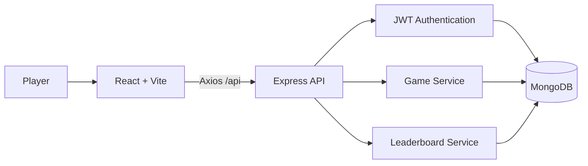

# Guess the Flag Name

**🔗 Live demo:** [https://aalimbaba.github.io/guess-the-flag-name/](https://aalimbaba.github.io/guess-the-flag-name/)

> **Status:** The frontend is deployed and live on GitHub Pages. The backend (auth, game saves, leaderboard) is not yet hosted anywhere public, so the live demo will load the interface but sign-up/login/leaderboard calls won't succeed until the API is deployed — see [Deployment](#deployment) below for the one-time setup to make that live too.

A full-stack geography quiz that challenges players to identify countries from their flags before the timer runs out. Choose a game mode and difficulty, build scoring streaks, track your accuracy, and compete on daily, weekly, and all-time leaderboards.

## Highlights

- Two answer modes: **Typing** and **Multiple Choice**
- Three difficulty levels: **Easy**, **Medium**, and **Hard**
- Fast 60-second game sessions
- Streak-based scoring with immediate visual feedback
- Typo-tolerant answers using Levenshtein distance
- Secure registration, login, and logout
- Persistent game results and player statistics
- Daily, weekly, and all-time leaderboards
- Profile dashboard with total games, best score, average accuracy, and recent matches
- Responsive interface with light/dark theme and optional background music
- API rate limiting, schema validation, protected routes, and centralized error handling

## How the Game Works

1. Create an account or sign in.
2. Select **Typing** or **Multiple Choice** mode.
3. Choose a difficulty level.
4. Identify as many flags as possible in 60 seconds.
5. Earn 10 points for a correct answer and a 5-point streak bonus after the first consecutive correct answer.
6. Lose 5 points for an incorrect answer; the score never falls below zero.
7. Review your final score, accuracy, and best streak.
8. Compare your result on the leaderboard.

Typing mode accepts exact answers, close partial matches, and minor spelling mistakes within a Levenshtein distance of two.

## Tech Stack

| Layer | Technologies |
| --- | --- |
| Frontend | React 19, Vite, React Router, Tailwind CSS, Axios, Framer Motion |
| Backend | Node.js, Express 5, Mongoose |
| Database | MongoDB |
| Authentication | JSON Web Tokens, bcrypt, HTTP cookies |
| Validation & security | Zod, CORS, Express Rate Limit |
| Developer tooling | ESLint, Nodemon, PostCSS, Autoprefixer |

## Architecture



The frontend manages the timer, flag selection, answer validation, score, streak, and feedback. Authenticated results are sent to the Express API, where MongoDB stores users and game history for profiles and leaderboards.

## Project Structure

```text
guess-the-flag-name/
├── frontend/
│   ├── src/
│   │   ├── assets/          # Flag data
│   │   ├── components/      # Reusable game and navigation UI
│   │   ├── context/         # Authentication state
│   │   ├── hooks/           # Timer and game engine
│   │   ├── pages/           # Login, game, profile, leaderboard
│   │   └── services/        # Axios API client
│   └── package.json
└── backend/
    ├── config/              # Database connection
    ├── controllers/         # Authentication, user, and game logic
    ├── middleware/          # Authentication and error handling
    ├── models/              # User and game schemas
    ├── routes/              # REST API routes
    ├── .env.example
    └── server.js
```

## Getting Started

### Prerequisites

- Node.js
- npm
- MongoDB running locally or a MongoDB Atlas connection string

### 1. Clone the repository

```bash
git clone https://github.com/AalimBaba/guess-the-flag-name.git
cd guess-the-flag-name
```

### 2. Configure and run the backend

```bash
cd backend
npm install
cp .env.example .env
npm run dev
```

On Windows Command Prompt, use `copy .env.example .env` instead of `cp`.

Update `backend/.env` when necessary:

```env
PORT=4000
CLIENT_URL=http://localhost:5173
MONGO_URI=mongodb://localhost:27017
MONGO_DB=guess_flags
JWT_SECRET=replace-with-a-long-random-secret
NODE_ENV=development
```

The API runs at `http://localhost:4000`.

### 3. Configure and run the frontend

Open another terminal:

```bash
cd guess-the-flag-name/frontend
npm install
npm run dev
```

Open the Vite URL shown in the terminal, normally `http://localhost:5173`.

## Available Scripts

### Frontend

```bash
npm run dev       # Start the Vite development server
npm run build     # Create a production build
npm run lint      # Run ESLint
npm run test      # Run frontend regression tests
npm run check     # Validate data/assets/secrets, lint, test, and build
npm run preview   # Preview the production build
```

### Backend

```bash
npm run dev       # Start the API with Nodemon
npm start         # Start the API with Node.js
```

## API Overview

| Method | Endpoint | Purpose | Authentication |
| --- | --- | --- | --- |
| `GET` | `/api/health` | Check API availability | No |
| `POST` | `/api/register` | Create an account | No |
| `POST` | `/api/login` | Sign in | No |
| `POST` | `/api/logout` | Sign out | No |
| `GET` | `/api/profile` | Load profile and game statistics | Yes |
| `POST` | `/api/game/save` | Save a completed game | Yes |
| `GET` | `/api/leaderboard?scope=all` | Load ranked scores | No |

Leaderboard scope can be `daily`, `weekly`, or `all`.

## Deployment

### Frontend — GitHub Pages (already live)

The `frontend/` app builds and deploys automatically via [`.github/workflows/deploy-pages.yml`](.github/workflows/deploy-pages.yml) on every push to `main` that touches `frontend/**`. It:

1. Validates datasets, local assets, and committed files, then runs ESLint and frontend tests.
2. Runs `npm run build` with Vite's `base` set to `/guess-the-flag-name/` and the repository `VITE_API_URL` variable.
3. Uploads `frontend/dist` as a Pages artifact and deploys it.
4. `public/404.html` + a small restore script in `index.html` handle deep-link refreshes (e.g. reloading on `/login`), since GitHub Pages has no server-side router.

No action needed here — this part is done and self-updating.

### Backend — Render + MongoDB Atlas (manual, ~10 minutes)

GitHub Pages only serves static files, so the Express/MongoDB API needs its own host. [`render.yaml`](render.yaml) in the repo root is a ready-to-use Render blueprint. To bring the API online:

1. **Create a free MongoDB Atlas cluster:**
   - Sign up at [mongodb.com/cloud/atlas](https://www.mongodb.com/cloud/atlas/register) and create a free M0 cluster.
   - Under **Database Access**, add a user with a password.
   - Under **Network Access**, add `0.0.0.0/0` (allow access from anywhere) so Render can reach it.
   - Copy the connection string from **Connect → Drivers** — it looks like `mongodb+srv://<user>:<password>@cluster0.xxxxx.mongodb.net/`.

2. **Deploy the backend on Render:**
   - Sign up at [render.com](https://render.com) and connect your GitHub account.
   - Choose **New → Blueprint**, select this repository — Render will read `render.yaml` automatically.
   - When prompted, paste the Atlas connection string as the `MONGO_URI` value.
   - Render generates `JWT_SECRET` automatically and sets `CLIENT_URL` to `https://aalimbaba.github.io` (already in `render.yaml`) so CORS allows requests from the deployed frontend.
   - Deploy — Render gives you a URL like `https://guess-the-flag-name-api.onrender.com`.

3. **Point the frontend at the live API:**
   - In the GitHub repo, go to **Settings → Secrets and variables → Actions → Variables**.
   - Add a repository variable named `VITE_API_URL` set to `https://guess-the-flag-name-api.onrender.com/api` (use your actual Render URL).
   - Re-run the "Deploy frontend to GitHub Pages" workflow (or push any change to `frontend/`) so the build picks up the new API URL.

Once both are live, registration, login, saved games, and the leaderboard will work end-to-end on the public URL.

## Production Notes

- The frontend is deployed at [aalimbaba.github.io/guess-the-flag-name](https://aalimbaba.github.io/guess-the-flag-name/) and rebuilds automatically on push.
- Set `CLIENT_URL` on the backend host to the deployed frontend origin (`https://aalimbaba.github.io`) — already configured in `render.yaml`.
- Use a strong, private `JWT_SECRET` (Render's blueprint generates one automatically).
- Use a managed MongoDB connection string (Atlas) for production, never a local instance.
- Set the `VITE_API_URL` repository variable so GitHub Actions builds the frontend against the live API instead of `localhost`.
- Keep secrets in environment variables and never commit the `.env` file.
- Run `npm run build` and `npm run lint` before deployment.

## Roadmap

- Add backend integration tests
- Add flag categories and regional game modes
- Add achievements and player badges
- Add password-reset and email-verification flows
- Deploy the backend to Render + MongoDB Atlas so the live demo is fully functional end-to-end
- Improve accessibility and keyboard navigation

## Author

**Muhammad Aalim Baba**

- [GitHub](https://github.com/AalimBaba)
- [LinkedIn](https://www.linkedin.com/in/aalimbaba-/)
- [Portfolio](https://aalimbaba.github.io/Portfolio/)

---

If you enjoy the project, consider giving the repository a star.
