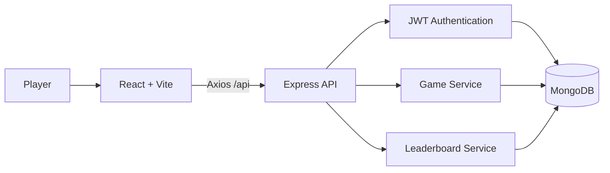

# Guess the Flag Name

A full-stack geography quiz that challenges players to identify countries from their flags before the timer runs out. Choose a game mode and difficulty, build scoring streaks, track your accuracy, and compete on daily, weekly, and all-time leaderboards.

## Highlights

- Two answer modes: **Typing** and **Multiple Choice**
- Three difficulty levels: **Easy**, **Medium**, and **Hard**
- Fast 60-second game sessions
- Streak-based scoring with immediate visual feedback
- Typo-tolerant answers using Levenshtein distance
- Secure registration, login, and logout
- Persistent game results and player statistics
- Daily, weekly, and all-time leaderboards
- Profile dashboard with total games, best score, average accuracy, and recent matches
- Responsive interface with light/dark theme and optional background music
- API rate limiting, schema validation, protected routes, and centralized error handling

## How the Game Works

1. Create an account or sign in.
2. Select **Typing** or **Multiple Choice** mode.
3. Choose a difficulty level.
4. Identify as many flags as possible in 60 seconds.
5. Earn 10 points for a correct answer and a 5-point streak bonus after the first consecutive correct answer.
6. Lose 5 points for an incorrect answer; the score never falls below zero.
7. Review your final score, accuracy, and best streak.
8. Compare your result on the leaderboard.

Typing mode accepts exact answers, close partial matches, and minor spelling mistakes within a Levenshtein distance of two.

## Tech Stack

| Layer | Technologies |
| --- | --- |
| Frontend | React 19, Vite, React Router, Tailwind CSS, Axios, Framer Motion |
| Backend | Node.js, Express 5, Mongoose |
| Database | MongoDB |
| Authentication | JSON Web Tokens, bcrypt, HTTP cookies |
| Validation & security | Zod, CORS, Express Rate Limit |
| Developer tooling | ESLint, Nodemon, PostCSS, Autoprefixer |

## Architecture



The frontend manages the timer, flag selection, answer validation, score, streak, and feedback. Authenticated results are sent to the Express API, where MongoDB stores users and game history for profiles and leaderboards.

## Project Structure

```text
guess-the-flag-name/
├── frontend/
│   ├── src/
│   │   ├── assets/          # Flag data
│   │   ├── components/      # Reusable game and navigation UI
│   │   ├── context/         # Authentication state
│   │   ├── hooks/           # Timer and game engine
│   │   ├── pages/           # Login, game, profile, leaderboard
│   │   └── services/        # Axios API client
│   └── package.json
└── backend/
    ├── config/              # Database connection
    ├── controllers/         # Authentication, user, and game logic
    ├── middleware/          # Authentication and error handling
    ├── models/              # User and game schemas
    ├── routes/              # REST API routes
    ├── .env.example
    └── server.js
```

## Getting Started

### Prerequisites

- Node.js
- npm
- MongoDB running locally or a MongoDB Atlas connection string

### 1. Clone the repository

```bash
git clone https://github.com/AalimBaba/guess-the-flag-name.git
cd guess-the-flag-name
```

### 2. Configure and run the backend

```bash
cd backend
npm install
cp .env.example .env
npm run dev
```

On Windows Command Prompt, use `copy .env.example .env` instead of `cp`.

Update `backend/.env` when necessary:

```env
PORT=4000
CLIENT_URL=http://localhost:5173
MONGO_URI=mongodb://localhost:27017
MONGO_DB=guess_flags
JWT_SECRET=replace-with-a-long-random-secret
NODE_ENV=development
```

The API runs at `http://localhost:4000`.

### 3. Configure and run the frontend

Open another terminal:

```bash
cd guess-the-flag-name/frontend
npm install
npm run dev
```

Open the Vite URL shown in the terminal, normally `http://localhost:5173`.

## Available Scripts

### Frontend

```bash
npm run dev       # Start the Vite development server
npm run build     # Create a production build
npm run lint      # Run ESLint
npm run preview   # Preview the production build
```

### Backend

```bash
npm run dev       # Start the API with Nodemon
npm start         # Start the API with Node.js
```

## API Overview

| Method | Endpoint | Purpose | Authentication |
| --- | --- | --- | --- |
| `GET` | `/api/health` | Check API availability | No |
| `POST` | `/api/register` | Create an account | No |
| `POST` | `/api/login` | Sign in | No |
| `POST` | `/api/logout` | Sign out | No |
| `GET` | `/api/profile` | Load profile and game statistics | Yes |
| `POST` | `/api/game/save` | Save a completed game | Yes |
| `GET` | `/api/leaderboard?scope=all` | Load ranked scores | No |

Leaderboard scope can be `daily`, `weekly`, or `all`.

## Production Notes

- Set `CLIENT_URL` to the deployed frontend origin.
- Use a strong, private `JWT_SECRET`.
- Use a managed MongoDB connection string for production.
- Serve the frontend and API over HTTPS.
- Keep secrets in environment variables and never commit the `.env` file.
- Run `npm run build` and `npm run lint` before deployment.

## Roadmap

- Add automated frontend and backend tests
- Add flag categories and regional game modes
- Add achievements and player badges
- Add password-reset and email-verification flows
- Add a public production deployment
- Improve accessibility and keyboard navigation

## Author

**Muhammad Aalim Baba**

- [GitHub](https://github.com/AalimBaba)
- [LinkedIn](https://www.linkedin.com/in/aalimbaba-/)
- [Portfolio](https://aalimbaba.github.io/Portfolio/)

---

If you enjoy the project, consider giving the repository a star.
